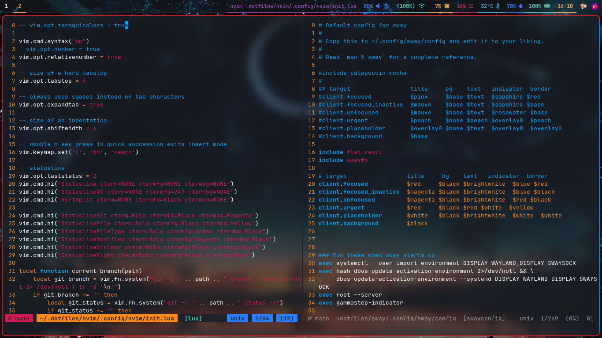

# dotfiles
My Arch Linux Sway dotfiles

## Install
Clone the repository and while inside the root repository directory, use GNU Stow to create symlinks

### Example
`stow --target="$HOME" --verbose nvim`
